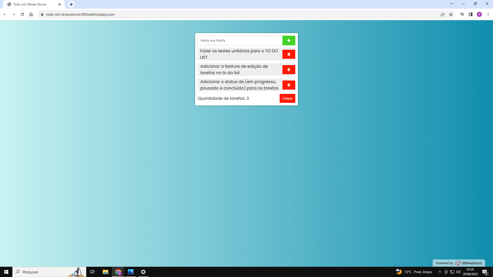
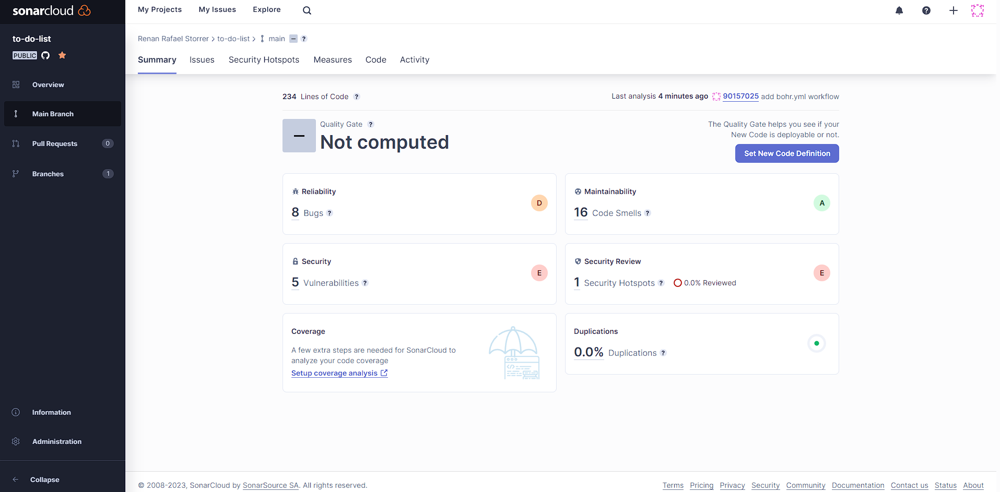

# To-Do List

Este é um projeto de To-Do List desenvolvido em PHP, MySQL e JavaScript. O objetivo é fornecer uma aplicação web simples para gerenciar tarefas.

# Meu Projeto

Clique <a href="https://todo-list-renanstorrer.000webhostapp.com/" target="_blank">aqui</a> para acessar o projeto.


[](#)
[](#)
[](#)
[](#)
[](#)
[](#)

## SonarCloud

Essa aplicação foi testada pela ferramenta sonarCloud, porém devido ao pouco tempo para conclusão, AINDA nao criei os testes unitários e também ainda não refatorei o código, mas é algo que irei fazer assim que possivel! 




## Como clonar o repositório

Você pode clonar este repositório executando o seguinte comando no seu terminal:

```shell
git clone git@github.com:Renan-Storrer/to-do-list.git
````


## Pré-requisitos

Antes de executar o projeto, certifique-se de ter os seguintes requisitos instalados em seu ambiente de desenvolvimento:

- Servidor web (por exemplo, Apache)
- PHP 7 ou superior
- MySQL 5 ou superior
- Navegador web compatível com JavaScript

## Instalação

Siga as etapas abaixo para configurar e executar o projeto localmente:

1. Crie uma tabela no seu MySQL com duas colunas, uma de ID primary KEY e outra de txt do tipo TEXT
2. Configure as informações do banco de dados no arquivo `config.php`.
3. Inicie o servidor web.
4. Abra o navegador web e acesse a URL do projeto.

## Contribuição

Contribuições são bem-vindas! Se você encontrar algum problema ou tiver alguma melhoria a sugerir, sinta-se à vontade para abrir uma issue ou enviar um pull request.

## Licença

Este projeto foi feito por Renan Rafael Storrer

## Meus contatos:

<div> 
  <a href = "mailto:storrerrenan@gmail.com"></a>
  <a href="https://www.linkedin.com/in/renanstorrer" target="_blank"></a> 
  <a href="http://api.whatsapp.com/send?1=pt_BR&phone=5541995843212" target="_blank"></a>
</div>


